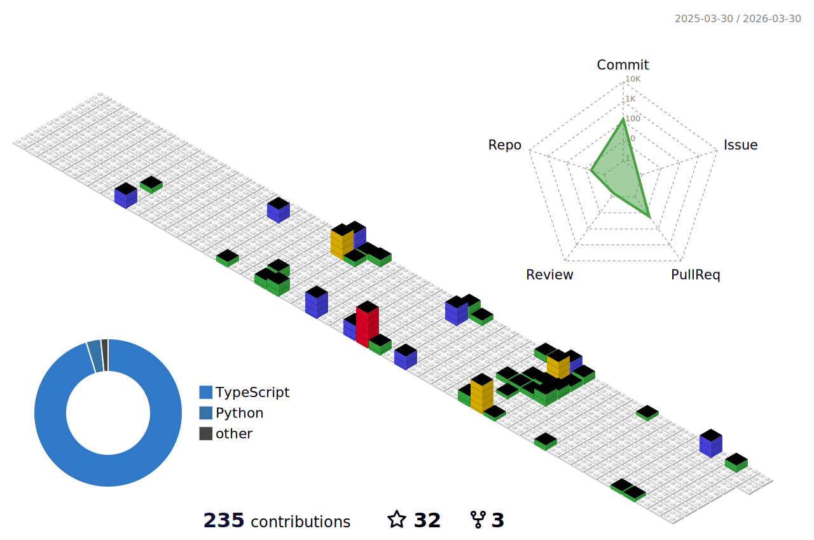

<h1 align="center">Hello 👋 , I'm Abu Huraira </h1>

<h3 align="center"> Passionate Software Engineer and MERN Enthusiastic.</h3> 

 I'm a current Software Engineering undergraduate student looking for an opportunity to put my skills to good use and make a difference. My experience covers web development and full-stack web development in Java, JavaScript, NodeJs, HTML, CSS, React Js, and  ReduxJs, as well as some PHP and Php MySQL.
I'm learning the Mern stack in order to advance my skills in the field of cutting-edge technology. I'm always looking for new ways to improve myself.  I'm here to do Full-Stack Web development for you on your business. 
<!-- 🥇 Over 2 years, I have developed a websites using Laravel, PHP, Java, Js, Bootstrap,  CSS3, and HTML5 including some my university projects and personal project. -->

### 🛠 &nbsp;Tech Stack
<!-- 
&nbsp; -->

&nbsp;
&nbsp;
&nbsp;
&nbsp;
&nbsp;
&nbsp;
&nbsp;
&nbsp;
&nbsp;
&nbsp;
&nbsp;
&nbsp;
&nbsp;
&nbsp;
&nbsp;
&nbsp;
&nbsp;
&nbsp;
&nbsp;

<!--  
 -->

<!-- \ -->
<!-- &nbsp; -->
<!-- &nbsp; -->
<!-- &nbsp; -->
<!-- &nbsp; -->

<!-- \

&nbsp;
&nbsp;
 -->

## My Statistics
<!--
 

  

 
--->

 

	
	

## Contribution Graph

<!-- 

 -->
 

<!-- 
 -->
<!--  -->
<!--  -->

<!-- 

-->

## Have a Smiley Day...😃 : 

<!--  -->
  
<h2 align='center'>Support Me By Starring ⭐ Some Of My Repositories</h2>
 

</img>

 
<!--  -->
